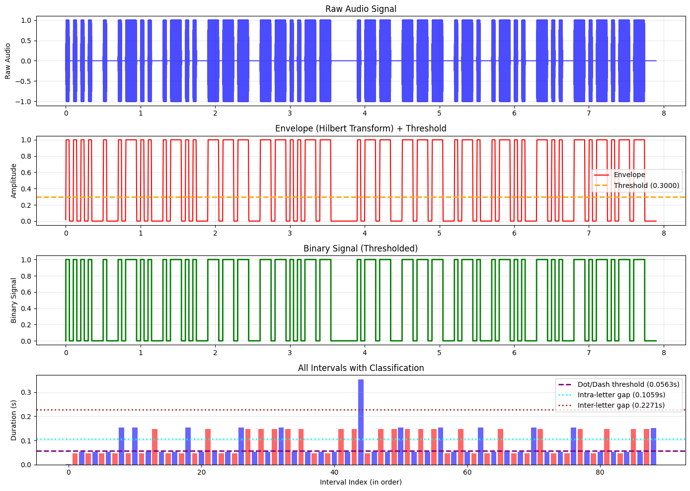

# Morse-Encoder-Decoder
A Python-based, bidirectional Morse code converter with interactive CLI that encodes English text to audio and decodes Morse audio back to text. Supports variable speed and pitch for encoding.

## Methodology

### Encoding Pipeline (Text → Audio)
1. **Text to Morse conversion**: Dictionary lookup converts each character to dots/dashes
2. **Morse to audio generation**: 
   - Dots: sine wave at specified frequency for `dot_duration` 
   - Dashes: sine wave for `dot_duration * 3`
   - Intra-character gaps: silence for `dot_duration`
   - Inter-letter gaps: silence for `dot_duration * 3`
   - Inter-word gaps: silence for `dot_duration * 7`
   - Applies fade in/out envelope to reduce audio artifacts
   - Outputs 16-bit PCM WAV file

### Decoding Pipeline (Audio → Text)
1. **Envelope extraction**: Hilbert transform + median filter to isolate signal envelope
2. **Binarization**: Threshold at 30% of peak envelope to convert to binary signal
3. **Interval detection**: Identifies contiguous blocks of tone/silence with precise timings
4. **Timing analysis**: Uses gap-finding algorithm to automatically detect dot vs dash thresholds
5. **Symbol reconstruction**: Builds morse code string from detected symbols
6. **Morse to text**: Dictionary lookup converts morse back to characters

---

## Instructions to Run

1. Clone the repository: `git clone https://github.com/K-ITCE/Morse-Encoder-Decoder.git`
2. Install dependencies: `pip install -r requirements.txt`
3. Run the program: `python main.py`

---

## Decoding Methodology - Technical Details

**Envelope Extraction & Binarization** (visualized in plot panels 1–3): The decoder uses the Hilbert transform to compute the analytic signal, extracting the amplitude envelope by taking absolute values. This removes phase information while preserving amplitude modulation, giving a smooth envelope that peaks during tone bursts and valleys during silence (panel 2). A median filter (kernel size 101 samples) smooths this envelope to remove high-frequency noise and transient clicks without degrading the fundamental rise/fall characteristics. The smoothed envelope is thresholded at 30% of its peak value to generate a binary signal representing tone (1) vs. silence (0) (panel 3).

**Adaptive Timing Threshold Detection** (visualized in plot panel 4): Rather than using fixed thresholds or clustering algorithms, the decoder employs an adaptive gap-finding approach: it sorts all detected tone durations and identifies the largest discontinuity between consecutive values, using that gap point as the dot/dash boundary (purple dashed line in panel 4). This is robust because Morse always exhibits a ~3:1 ratio between dot and dash duration, creating a clear separation. Silence durations are similarly split by midpoint—the first half represents intra-character gaps (~1:1 ratio, cyan line), the second represents inter-letter gaps (~3:1 ratio, brown line). These thresholds are computed once per file, making the decoder adaptive to variable speeds and signal conditions.

**Symbol Reconstruction**: Intervals are classified as dots/dashes by comparing duration against the computed thresholds (panel 4 shows red bars below the purple line = dots, above = dashes; blue bars reveal gap classification), reconstructing the morse string with space delimiters between characters and `/` delimiters between words. The entire pipeline is speed-invariant—scaling dot duration proportionally preserves relative thresholds, ensuring decoding accuracy across different speeds and frequencies.

---

## Visualization

The decoder includes an optional **4-panel diagnostic plot** (`plots/morse_analysis.png`) that visualizes the decoding pipeline:

**"Hello, World!"** or **".... . .-.. .-.. --- --..-- / .-- --- .-. .-.. -.. -.-.--"**

1. **Raw Audio Signal**: Original waveform from the WAV file
2. **Envelope + Threshold**: Hilbert transform result with 30% threshold line showing signal detection boundary
3. **Binary Signal**: Thresholded output (1 = tone, 0 = silence)
4. **Interval Classification**: Bar chart showing all detected intervals in chronological order with:
   - Red bars = tone intervals
   - Blue bars = silence intervals
   - Purple dashed line = dot/dash classification threshold
   - Cyan dotted line = intra-character gap threshold
   - Brown dotted line = inter-letter gap threshold

This visualization makes the timing classification logic transparent and helps users understand how variable speeds/frequencies are adaptively handled.

---

## Specification Sheet

| Aspect | Details |
|--------|---------|
| **Input (Encode)** | English text (a-z, 0-9, punctuation) |
| **Output (Encode)** | WAV file (16-bit PCM, 22050 Hz default) |
| **Input (Decode)** | WAV file (any sample rate, mono) |
| **Output (Decode)** | English text |
| **Configurable** | Dot duration (speed), tone frequency (pitch), visualization (on/off) |
| **Speed Range** | 0.1-0.2s per dot (via multiplier 0.5-2.0) |
| **Pitch Range** | 400-1000 Hz recommended |
| **Accuracy** | 100% on correctly formatted morse audio |
| **Dependencies** | librosa, scipy, pandas, numpy, matplotlib |
| **CLI Interface** | Menu-driven with interactive parameter entry |
| **Encode Filename Format** | `wav/morse_HHMMSS.wav` (timestamp-based, no overwrites) |
| **Plot Output** | `plots/morse_analysis.png` (overwrites on each decode) |

---

## Major Challenges & Solutions

### Challenge 1: Timing Threshold Detection
**Problem**: KMeans clustering was overly complex and produced `nan` values due to dataframe indexing issues when filtering.
**Solution**: Replaced with simpler gap-detection algorithm that finds the largest discontinuity in sorted tone durations to distinguish dots from dashes. Midpoint clustering for silence gaps using median of first/second halves.

### Challenge 2: Floating-Point Precision
**Problem**: Tone durations like 0.0970s failed `<=` comparisons due to floating-point rounding.
**Solution**: Added 20% buffer to thresholds (`dot_max = unit * 1.2`) to handle edge cases gracefully.

### Challenge 3: Mixed Dot/Dash Ratio Variance
**Problem**: Messages with many dashes caused median calculation to pick dash duration as the "unit", breaking detection.
**Solution**: Use largest gap in sorted tone durations as the split point, not median—more robust for mixed content.

### Challenge 4: Dataframe Index Misalignment
**Problem**: `intervals[intervals['value']==1]['end'] - intervals['start']` produced NaN values.
**Solution**: Filter into separate variable first, then perform arithmetic on matching indices.
